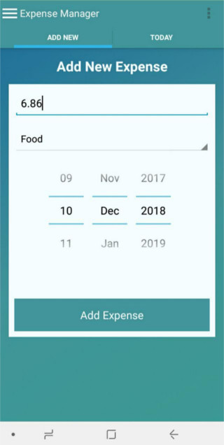

# ExpenseManager
An open source Android app to manage expenses

## Screenshots

## Testing videos
https://www.youtube.com/watch?v=gdsxVfq-yNM&list=PLFYf87MeyEq588ibGPTu5lEhnJZG6KsmR

https://www.youtube.com/watch?v=Vbe6kklkNhA

https://www.youtube.com/watch?v=-uMo4jQdl8s

## Versions
Version 1.0 - basic version, before October 2018
- Categories of expenses
- Add expense for the day
- List of day expenses
- Graph of month expenses

Version November 2018
- Added useful default category
- Export/Import database
- Create a different databases (actually, by associating every DB entry with a DB name)

Version December 2018
- Support to Euro
- Expenses now deal with java.util.Date, and not strings representing them
- SW Architecture reshaping, which is now more MVC
- floating point expenses instead of integer ones

TODO
- Move "Add Expense" button above for usability
- Fix graph of Current Month view
- Better graphs
- Add other graphs, with other info
- Better GUI
- Encrypt DB
- ...

## Acknowledgements
**Agostino Mascitti** - https://github.com/HerrAugust/ExpenseManager
- see Version November 2018 above
- see Version December 2018 above

**Ajit Singh**'s original version - https://github.com/ajitsing/ExpenseManager

## Licence

The MIT License (MIT)

Copyright (c) 2016, 2018 Ajit Singh, Agostino Mascitti
